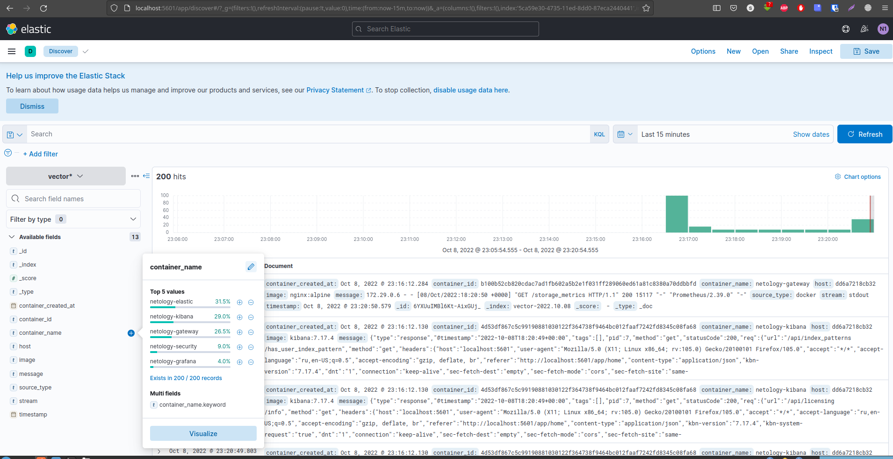
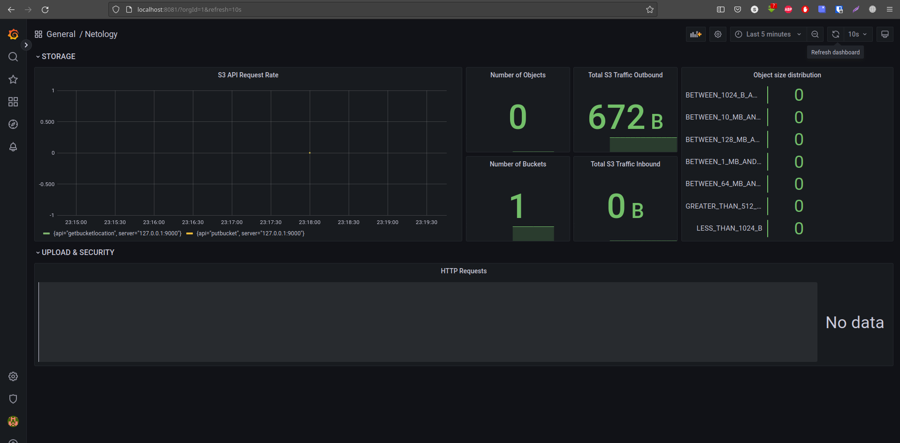

# Домашнее задание к занятию "11.03 Микросервисы: подходы"

Вы работаете в крупной компанию, которая строит систему на основе микросервисной архитектуры.
Вам как DevOps специалисту необходимо выдвинуть предложение по организации инфраструктуры, для разработки и эксплуатации.

## Задача 1: Обеспечить разработку

Предложите решение для обеспечения процесса разработки: хранение исходного кода, непрерывная интеграция и непрерывная поставка. 
Решение может состоять из одного или нескольких программных продуктов и должно описывать способы и принципы их взаимодействия.

Решение должно соответствовать следующим требованиям:
- Облачная система;
- Система контроля версий Git;
- Репозиторий на каждый сервис;
- Запуск сборки по событию из системы контроля версий;
- Запуск сборки по кнопке с указанием параметров;
- Возможность привязать настройки к каждой сборке;
- Возможность создания шаблонов для различных конфигураций сборок;
- Возможность безопасного хранения секретных данных: пароли, ключи доступа;
- Несколько конфигураций для сборки из одного репозитория;
- Кастомные шаги при сборке;
- Собственные докер образы для сборки проектов;
- Возможность развернуть агентов сборки на собственных серверах;
- Возможность параллельного запуска нескольких сборок;
- Возможность параллельного запуска тестов;

Обоснуйте свой выбор.

> ||Gitlab CI/CD|Jenkins|TeamCity|BitBucket|
> |:---|:---:|:---:|:---:|:---:|
> |Облачная система|+|-|+|+|
> |Система контроля версий Git|+|-|-|+|
> |Репозиторий на каждый сервис|+|+|+|+|
> |Запуск сборки по событию из системы контроля версий|+|+|+|-|
> |Запуск сборки по кнопке с указанием параметров|+|+|+|-|
> |Возможность привязать настройки к каждой сборке|+|+|+|+|
> |Возможность создания шаблонов для различных конфигураций сборок|+|+|+|+|
> |Возможность безопасного хранения секретных данных: пароли, ключи доступа|+|+|+|-|
> |Несколько конфигураций для сборки из одного репозитория|+|+|+|-|
> |Кастомные шаги при сборке|+|+|+|+|
> |Собственные докер образы для сборки проектов|+|+|+|-|
> |Возможность развернуть агентов сборки на собственных серверах|+|+|+|-|
> |Возможность параллельного запуска нескольких сборок|+|+|+|+|
> |Возможность параллельного запуска тестов|+|+|+|+|
>
> Из таблицы видно, что всем требованиям полностью удовлетворяет `Gitlab`, который является универсальном инструментом, сочетающим в себе возможности хранилища исходного кода, сервис-деска, присутствует возможность отслеживать состояние окружений, хранить различные типы артефактов, использовать хранилище контейнеров, подключать модуль Terraform и многое другое. К тому же это решение хорошо интегрируется с популярными IDE.

## Задача 2: Логи

Предложите решение для обеспечения сбора и анализа логов сервисов в микросервисной архитектуре.
Решение может состоять из одного или нескольких программных продуктов и должно описывать способы и принципы их взаимодействия.

Решение должно соответствовать следующим требованиям:
- Сбор логов в центральное хранилище со всех хостов обслуживающих систему;
- Минимальные требования к приложениям, сбор логов из stdout;
- Гарантированная доставка логов до центрального хранилища;
- Обеспечение поиска и фильтрации по записям логов;
- Обеспечение пользовательского интерфейса с возможностью предоставления доступа разработчикам для поиска по записям логов;
- Возможность дать ссылку на сохраненный поиск по записям логов;

Обоснуйте свой выбор.

> В случае, если ресурсов достаточно много, лучшим выбором бедет стек `ELK`:
>
> - `elastic beats` для отправки логов;
> - `logstash` для препроцессинга логов - фильтрации и модификации;
> - `elasticsearch` для хранения;
> - `kibana` в качестве пользовательского интерфейса.
>
> Стек ELK хорошо известен и зарекомендовал себя в широкой среде, к нему легко найти необходимую информацию и документацию, также как и специалистов, которые с ним работали.

## Задача 3: Мониторинг

Предложите решение для обеспечения сбора и анализа состояния хостов и сервисов в микросервисной архитектуре.
Решение может состоять из одного или нескольких программных продуктов и должно описывать способы и принципы их взаимодействия.

Решение должно соответствовать следующим требованиям:
- Сбор метрик со всех хостов, обслуживающих систему;
- Сбор метрик состояния ресурсов хостов: CPU, RAM, HDD, Network;
- Сбор метрик потребляемых ресурсов для каждого сервиса: CPU, RAM, HDD, Network;
- Сбор метрик, специфичных для каждого сервиса;
- Пользовательский интерфейс с возможностью делать запросы и агрегировать информацию;
- Пользовательский интерфейс с возможность настраивать различные панели для отслеживания состояния системы;

Обоснуйте свой выбор.

> Наиболее оптимальным решением вижу связку из:
> - `node_exporter` (для предоставления метрик о сосотоянии хостов);
> - Интеграции [клиентских библиотек Prometheus](https://prometheus.io/docs/instrumenting/clientlibs/) в код микросервисов для экспорта специфичных метрик;
> - `Prometheus` (для сбора метрик);
> - `Grafana` (для построения дашбордов и настройки оповещений).
>
>Данная связка выбрана потому что обладает хорошей производительностью, имеет широкое комьюнити и обширную документацию, для популярных языков программирования есть набор библиотек, помогающих добавить экспорт метрик сервисов в формате Prometheus.

## Задача 4: Логи * (необязательная)

Продолжить работу по задаче API Gateway: сервисы используемые в задаче пишут логи в stdout. 

Добавить в систему сервисы для сбора логов Vector + ElasticSearch + Kibana со всех сервисов обеспечивающих работу API.

### Результат выполнения: 

docker compose файл запустив который можно перейти по адресу http://localhost:8081 по которому доступна Kibana.
Логин в Kibana должен быть admin пароль qwerty123456

Порт Kibana я оставил стандартным, 5601. Порт 8081 будет использоваться для Grafana.

Скрины

[docker-compose](./11-microservices-03-approaches/docker-compose.yaml)

## Задача 5: Мониторинг * (необязательная)

Продолжить работу по задаче API Gateway: сервисы используемые в задаче предоставляют набор метрик в формате prometheus:

- Сервис security по адресу /metrics
- Сервис uploader по адресу /metrics
- Сервис storage (minio) по адресу /minio/v2/metrics/cluster

Добавить в систему сервисы для сбора метрик (Prometheus и Grafana) со всех сервисов обеспечивающих работу API.
Построить в Graphana dashboard показывающий распределение запросов по сервисам.

### Результат выполнения: 

docker compose файл запустив который можно перейти по адресу http://localhost:8081 по которому доступна Grafana с настроенным Dashboard.
Логин в Grafana должен быть admin пароль qwerty123456

Скрины

[nginx.conf](./11-microservices-03-approaches/gateway/nginx.conf)

[Исходники](./11-microservices-03-approaches/)