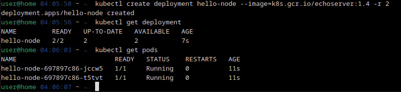
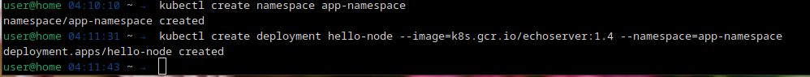
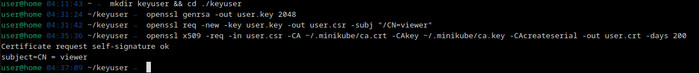
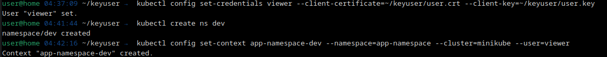
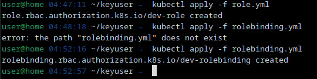
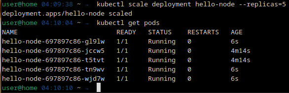

# Домашнее задание к занятию "12.2 Команды для работы с Kubernetes"
Кластер — это сложная система, с которой крайне редко работает один человек. Квалифицированный devops умеет наладить работу всей команды, занимающейся каким-либо сервисом.
После знакомства с кластером вас попросили выдать доступ нескольким разработчикам. Помимо этого требуется служебный аккаунт для просмотра логов.

## Задание 1: Запуск пода из образа в деплойменте
Для начала следует разобраться с прямым запуском приложений из консоли. Такой подход поможет быстро развернуть инструменты отладки в кластере. Требуется запустить деплоймент на основе образа из hello world уже через deployment. Сразу стоит запустить 2 копии приложения (replicas=2). 

Требования:
 * пример из hello world запущен в качестве deployment
 * количество реплик в deployment установлено в 2
 * наличие deployment можно проверить командой kubectl get deployment
 * наличие подов можно проверить командой kubectl get pods



## Задание 2: Просмотр логов для разработки
Разработчикам крайне важно получать обратную связь от штатно работающего приложения и, еще важнее, об ошибках в его работе. 
Требуется создать пользователя и выдать ему доступ на чтение конфигурации и логов подов в app-namespace.

Требования: 
 * создан новый токен доступа для пользователя
 * пользователь прописан в локальный конфиг (~/.kube/config, блок users)
 * пользователь может просматривать логи подов и их конфигурацию (kubectl logs pod <pod_id>, kubectl describe pod <pod_id>)

Создание неймспейса с деплоем hello-node:


Создание сертификата нового пользователя:


Создание пользователя, пространства имен и приложения для проверки:


Создание и привязка роли:


<details><summary>role.yaml</summary>

```yaml
apiVersion: rbac.authorization.k8s.io/v1
kind: Role
metadata:
  namespace: app-namespace
  name: dev-role
rules:
- apiGroups: [""]
  resources: ["pods", "pods/log"]
  verbs: ["get", "list"]
```

</details>

<details><summary>rolebinding.yaml</summary>

```yaml
apiVersion: rbac.authorization.k8s.io/v1
kind: RoleBinding
metadata:
  name: dev-rolebinding
  namespace: app-namespace
subjects:
- kind: User
  name: viewer-user
  apiGroup: rbac.authorization.k8s.io
roleRef:
  kind: Role
  name: dev-role
  apiGroup: rbac.authorization.k8s.io
```

</details>

Переключение контекста:

```console
user@home 04:52:57 ~/keyuser →  kubectl config use-context app-namespace-dev
Switched to context "app-namespace-dev".
user@home 04:57:37 ~/keyuser →  
```

Проверка привелегий:

```console
user@home 05:37:51 ~ →  kubectl config set-credentials viewer --client-certificate=./keyuser/user.crt --client-key=./keyuser/user.key
User "viewer" set.
user@home 05:38:28 ~ →  kubectl get pods
NAME                         READY   STATUS    RESTARTS   AGE
hello-node-697897c86-7v56l   1/1     Running   0          86m
user@home 05:38:30 ~ →  kubectl describe pods | head -n 3
Name:             hello-node-697897c86-7v56l
Namespace:        app-namespace
Priority:         0
user@home 05:40:11 ~ →  kubectl logs pods/hello-node-697897c86-7v56l
user@home 05:40:40 ~ →  kubectl get pods -A
Error from server (Forbidden): pods is forbidden: User "viewer" cannot list resource "pods" in API group "" at the cluster scope
user@home 05:41:08 ~ →  kubectl delete pod hello-node-697897c86-7v56l
Error from server (Forbidden): pods "hello-node-697897c86-7v56l" is forbidden: User "viewer" cannot delete resource "pods" in API group "" in the namespace "app-namespace"
user@home 05:41:29 ~ →  
```
## Задание 3: Изменение количества реплик 
Поработав с приложением, вы получили запрос на увеличение количества реплик приложения для нагрузки. Необходимо изменить запущенный deployment, увеличив количество реплик до 5. Посмотрите статус запущенных подов после увеличения реплик. 

Требования:
 * в deployment из задания 1 изменено количество реплик на 5
 * проверить что все поды перешли в статус running (kubectl get pods)

