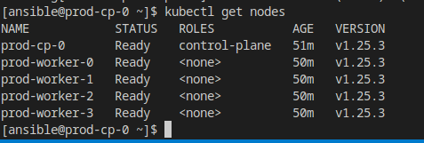

# Домашнее задание к занятию "12.4 Развертывание кластера на собственных серверах, лекция 2"
Новые проекты пошли стабильным потоком. Каждый проект требует себе несколько кластеров: под тесты и продуктив. Делать все руками — не вариант, поэтому стоит автоматизировать подготовку новых кластеров.

## Задание 1: Подготовить инвентарь kubespray
Новые тестовые кластеры требуют типичных простых настроек. Нужно подготовить инвентарь и проверить его работу. Требования к инвентарю:
* подготовка работы кластера из 5 нод: 1 мастер и 4 рабочие ноды;
* в качестве CRI — containerd;
* запуск etcd производить на мастере.

```yaml
[all]
prod-cp-0 ansible_host=178.154.247.98 ansible_user=ansible
prod-worker-0 ansible_host=178.154.224.57 ansible_user=ansible
prod-worker-1 ansible_host=178.154.240.7 ansible_user=ansible
prod-worker-2 ansible_host=84.252.131.77 ansible_user=ansible
prod-worker-3 ansible_host=178.154.231.205 ansible_user=ansible

[kube_control_plane]
prod-cp-0

[kube_node]
prod-worker-0
prod-worker-1
prod-worker-2
prod-worker-3

[etcd]
prod-cp-0

[k8s_cluster:children]
kube_node
kube_control_plane
```


## Задание 2 (*): подготовить и проверить инвентарь для кластера в AWS
Часть новых проектов хотят запускать на мощностях AWS. Требования похожи:
* разворачивать 5 нод: 1 мастер и 4 рабочие ноды;
* работать должны на минимально допустимых EC2 — t3.small.

[Конфигурационный файл terraform](./12-kubernetes-04-install-part-2/terraform/main.tf)